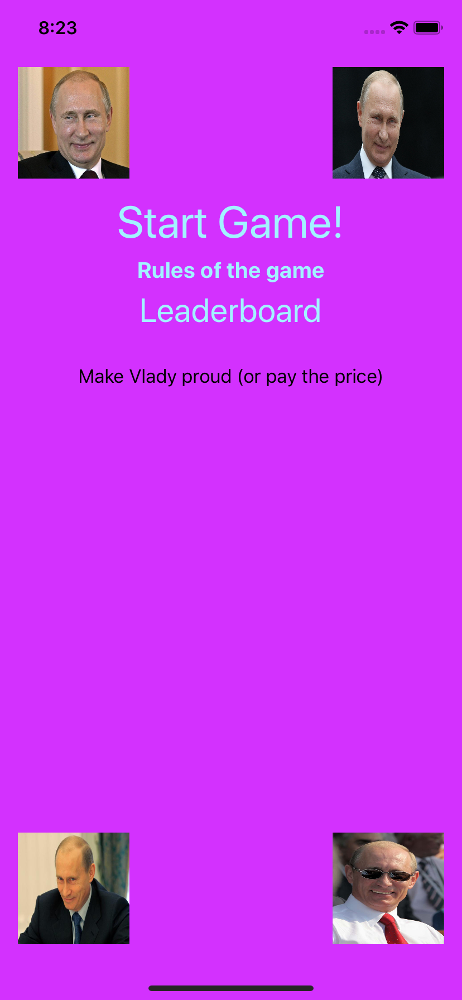
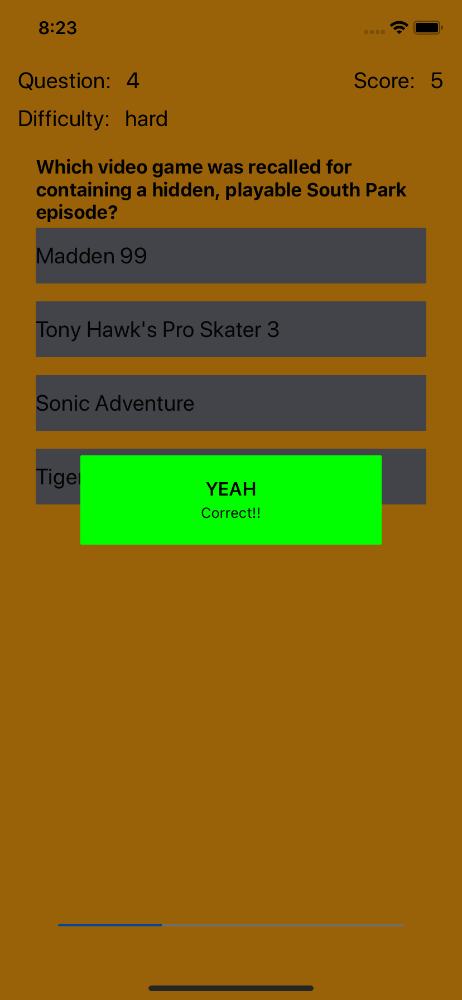
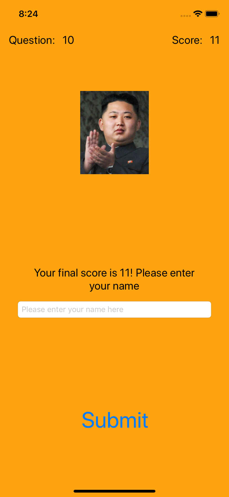
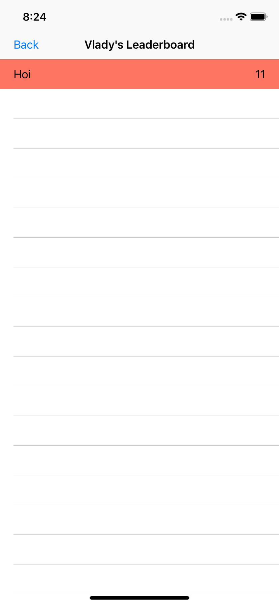

# Trivia
App die random multiple choice questions stelt
- progress bar
- verschillend aantal punten voor iedere difficulty
- pop-up message met of je het antwoord goed of fout hebt
- pagina waar de vragen zichtbaar zijn
- pagina waar spelers de scores kunnen terug zien
- label met categorie
- label met score
- label met difficulty
- update question pagina zodra alle vragen zijn beantwoord zodat speler resultaten kan invoeren en door kan geven
- speler krijgt na invoeren gegevens de scores te zien

